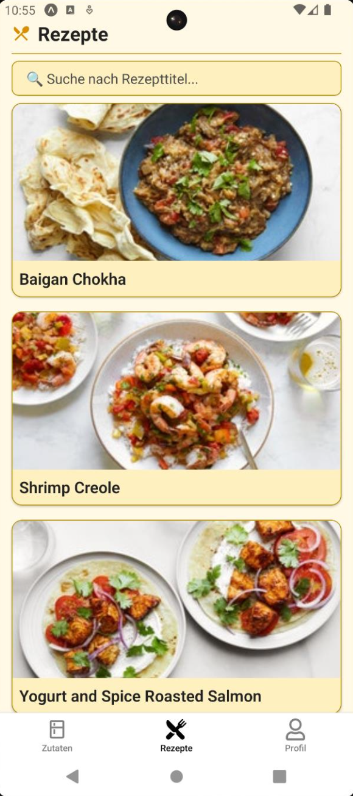
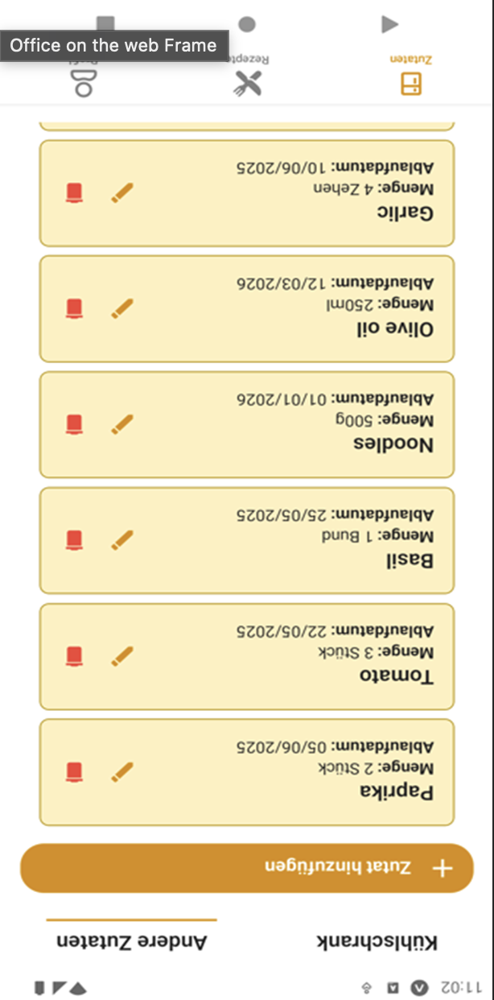
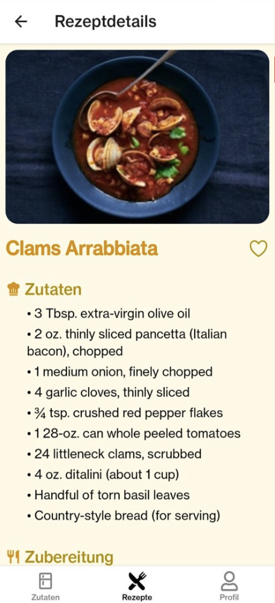

# Recipe Generator

Der Recipe Generator ist eine mobile Anwendung, die Rezeptvorschläge basierend auf vorhandenen Zutaten und persönlichen Ernährungsvorlieben generiert. Die App wurde mit React Native entwickelt und im Rahmen der Lehrveranstaltung *Mensch-Computer Interaktion* an der Universität Wien umgesetzt.

Ziel des Projekts ist es, Lebensmittelverschwendung zu reduzieren, die Kochplanung zu vereinfachen und eine klar strukturierte, nutzerfreundliche Lösung bereitzustellen.

---

## Funktionen

### Zutatenverwaltung
- Verwaltung von Zutaten in den Bereichen *Kühlschrank* und *Andere Zutaten*
- Hinzufügen, Bearbeiten und Löschen von Zutaten
- Verbesserte Listenstruktur und Whitespace-Anpassungen basierend auf Usability-Feedback

### Rezeptvorschläge
- Sortierung nach Übereinstimmung mit vorhandenen Zutaten
- Berücksichtigung von Ernährungspräferenzen  
  (vegetarisch, vegan, glutenfrei, laktosefrei)
- Detailseite mit Informationen zu Zubereitung, Zutaten und Nährwerten

### Profil und soziale Funktionen
- Verwaltung persönlicher Ernährungsvorlieben
- Freunde hinzufügen und deren Vorlieben in Rezeptvorschläge einbeziehen
- Konsistentes Button-Layout und verbesserte Platzaufteilung

---

## Technische Implementierung

Framework:  
React Native (Android & iOS, getestet über Expo)

Getestete Geräte:  
Pixel 6, Pixel 3a, iPhone 16

API-Versionen:  
Android API 28, 30, 31

Entwicklungsdauer:  
42 Stunden

---

## Usability-Evaluierung

Das System wurde im Rahmen einer moderierten Usability-Studie getestet.  
Zentrale Erkenntnisse:

- klare, verständliche Struktur der App
- Freundesfunktion wurde als intuitiv wahrgenommen
- Verbesserungsbedarf bei Kontrasten, Farben und Whitespace
- teilweise unklare Darstellung der Kühlschrank-Synchronisation

Diese Punkte wurden dokumentiert und größtenteils in der finalen Version berücksichtigt.

---

## Installation
```
git clone <repository-url>
cd <projektname>
npm install
npx expo start
```
## Screenshots

<p align="center">
  
  
  
</p>

<p align="center">
  <em>Home Screen – Zutatenverwaltung – Details</em>
</p>
